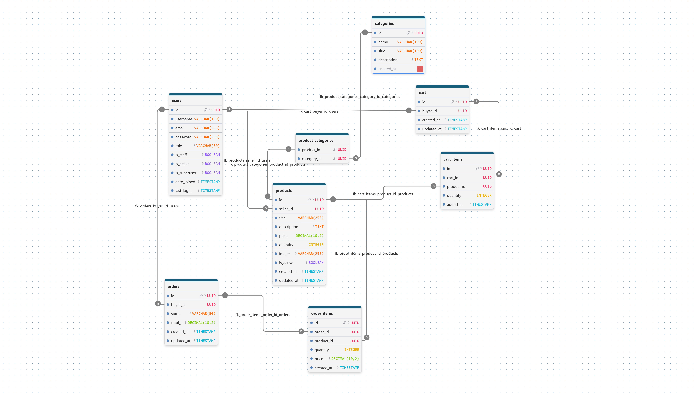

# Storefront Management System

A full-stack web application designed for interaction between **Sellers** (who manage product listings and quantities) and **Buyers** (who browse products, manage their cart, and place orders).

## Technology Stack

* **Backend:** Python (Django, Django REST Framework, JWT Authentication)
* **Frontend:** React, TypeScript, TailwindCSS v4, shadcn/ui, Vite, Zustand
* **Database:** PostgreSQL
* **Package Manager:** `pnpm` (Frontend), `pip` / `virtualenv` (Backend)

---

## Getting Started

### Option A: Run with Docker (Recommended)

The easiest way to run the entire stack (Database, Backend, and Frontend) is using Docker Compose.

1. **Build and start all services:**
   ```bash
   docker compose up --build
   ```

2. **Access the applications:**
   * **Frontend React App:** `http://localhost:5173/`
   * **Backend Django API:** `http://localhost:8000/`
   * **API Docs (Swagger UI):** `http://localhost:8000/api/schema/swagger-ui/`

3. **Running commands inside the backend container (Optional):**
   * Create a Django superuser:
     ```bash
     docker compose exec backend python manage.py createsuperuser
     ```
   * Run backend tests:
     ```bash
     docker compose exec backend python manage.py test
     ```

---

### Option B: Run Locally (Manual Setup)

If you prefer to run the components individually on your host machine:

#### 1. Database Setup
Start only the PostgreSQL database using Docker:
```bash
docker compose up -d postgres
```
Database connection details:
* **Host:** `localhost`
* **Port:** `5432`
* **Database Name:** `storefront_db`
* **User:** `bunny`
* **Password:** `bunny1234!`

#### 2. Backend Setup (Django)
1. Navigate to the `backend` directory and set up a Python virtual environment:
   ```bash
   cd backend
   python3 -m venv venv # if python3 doesn't work try "python"
   source venv/bin/activate  # On Windows use: venv\Scripts\activate
   pip install -r requirements.txt
   ```

2. Create a `.env` file in the `backend/` directory by copying `.env.example`:
   ```bash
   cp .env.example .env
   ```

3. Ensure the database settings match your local PostgreSQL configuration:
   ```env
   SECRET_KEY=django-insecure-your-secret-key-here
   DEBUG=True
   DB_NAME=storefront_db
   DB_USER=bunny
   DB_PASSWORD=bunny1234!
   DB_HOST=localhost
   DB_PORT=5432
   ```

4. Apply migrations and start the backend development server:
   ```bash
   python manage.py migrate
   python manage.py runserver
   ```
   The Django API will be accessible at `http://localhost:8000/` and the API Docs (Swagger UI) at `http://localhost:8000/api/schema/swagger-ui/`.

#### 3. Frontend Setup (React)
1. Navigate to the `frontend` directory and install dependencies:
   ```bash
   cd frontend
   pnpm install
   ```

2. Create a `.env` file in the `frontend/` directory by copying `.env.example`:
   ```bash
   cp .env.example .env
   ```

3. Start the Vite development server:
   ```bash
   pnpm run dev
   ```
   The React frontend will be accessible at `http://localhost:5173/`.

---

## Running Backend Tests

To execute the test suite for the Django backend API, run the following command in the `backend/` directory:

```bash
# Run Django backend tests
python manage.py test
```

---

## Database Design

### Entity-Relationship Diagram (ERD)




### Table Explanations
* **users**: Stores user accounts, distinguishing access levels by role: `seller` or `buyer`.
* **categories**: Groups products into classifications (e.g., Electronics, Clothing) with a unique name and slug.
* **products**: Items listed for sale by a seller (`seller_id`), including details like title, description, price, quantity, and image.
* **cart**: The shopping cart associated with a buyer (has a One-to-One relationship with the users table).
* **cart_items**: Junction table mapping products and quantities in a specific cart.
* **orders**: Finalized orders placed by a buyer, including delivery status, total price, and timestamps.
* **order_items**: Products included in an order, preserving a snapshot of the price at the time of purchase (`price_at_purchase`).
* **product_categories**: Junction table representing the Many-to-Many relationship between products and categories.

---

## Directory Structure

* `/.github` - GitHub Actions CI/CD workflow configuration.
* `/backend` - Django REST Framework API application.
* `/frontend` - React application with Vite and TailwindCSS.
* `/docker-compose.yml` - PostgreSQL service container config.
